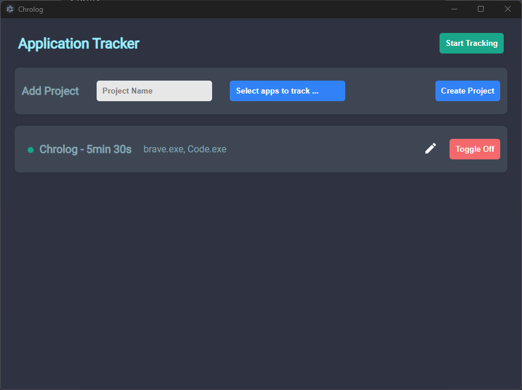
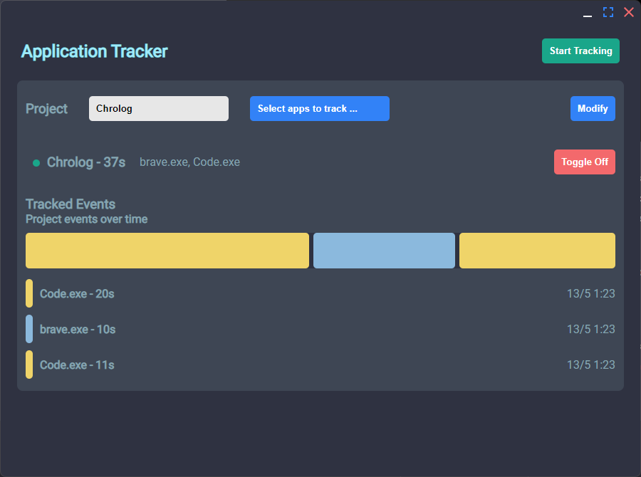

# Chrolog - A automated time tracking tool

This monitoring software recognizes actions through keyboard strokes and mouse movements, subsequently recording the time associated with each project.

Check the release page for binary files.




## Recommended IDE Setup

- [VSCode](https://code.visualstudio.com/) + [ESLint](https://marketplace.visualstudio.com/items?itemName=dbaeumer.vscode-eslint) + [Prettier](https://marketplace.visualstudio.com/items?itemName=esbenp.prettier-vscode)

## Project Setup

### Development

```bash
npm install
npm run dev
```

### Build

```bash
$ npm run build:win
```
