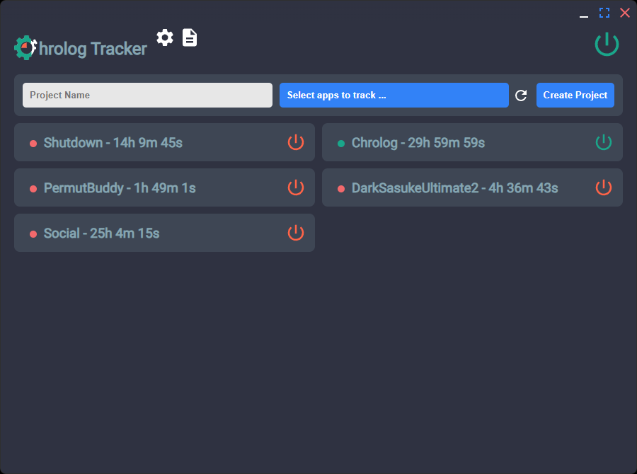

# Chrolog - Your Open-Source Time Tracking Tool

Chrolog is a time tracking software. It tracks time by recognizing keyboard and mouse actions, and records how long you spend on each project.  
With the Chrome extension [Chrolog - TabTracker](https://github.com/Lukylix/Chrolog-TabTracker) (currently under review on the Chrome store), you can choose which websites to exclude from tracking.

Visit the release page to download binary files.



# How to Run on Linux

To run Chrolog on Linux, launch it from a terminal  
(Without launching from a terminal, the necessary sudo prompt will not function correctly).

# Development Guidelines

## Ideal IDE Setup

- [VSCode](https://code.visualstudio.com/)
- [ESLint](https://marketplace.visualstudio.com/items?itemName=dbaeumer.vscode-eslint)
- [Prettier](https://marketplace.visualstudio.com/items?itemName=esbenp.prettier-vscode)

## How to Set Up the Project

### Development

Type these commands in your terminal:

```bash
npm install
npm run dev
```

### Build

To build the project for Windows or Linux, type:

```bash
npm run build:win
```

or

```bash
npm run build:linux
```
