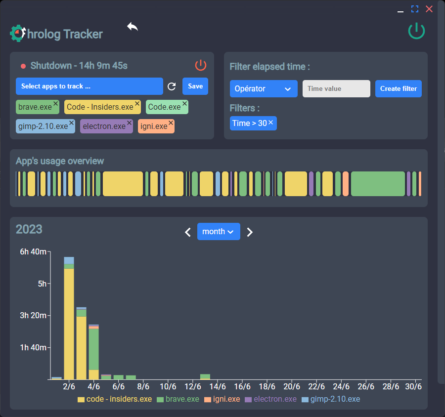

# Chrolog - Your Open-Source Time Tracking Tool

Chrolog is a time tracking software. It tracks time by recognizing keyboard and mouse actions, and records how long you spend on each project.  
With the Chrome extension [Chrolog - TabTracker](https://chromewebstore.google.com/detail/chrolog-tabtracker/kcfeanjmngaljpdfnojiijemmfmdlapf) , you can choose which websites to exclude from tracking.

Visit the [release page](https://github.com/Lukylix/Chrolog/releases) to download binary files.

# Screenshots




# How to Run on Linux

To run Chrolog on Linux, launch it from a terminal.  
Without launching from a terminal, the necessary sudo prompt will not function correctly.

# Development Guidelines

## Ideal IDE Setup

- [VSCode](https://code.visualstudio.com/)
- [ESLint](https://marketplace.visualstudio.com/items?itemName=dbaeumer.vscode-eslint)
- [Prettier](https://marketplace.visualstudio.com/items?itemName=esbenp.prettier-vscode)

## How to Set Up the Project

### Development

Type these commands in your terminal:

```bash
npm install
npm run m-postinstall
npm run dev
```

### Build

#### For windows :

Ensure that you have the Build Tools for [Microsoft Visual Studio 2022](https://visualstudio.microsoft.com/downloads/) installed.  
(Tools for Visual Studio --> Build Tools for Visual Studio 2022)

if you want to recompile the cpp files install [gcc](https://code.visualstudio.com/docs/cpp/config-mingw#_prerequisites) for Visual Studio code.

In Visual Studio Code :  
`ctrl`+`shift`+`B` To run the chrolog.dll build (build-lib-win).
or  
Execute command -> Task: run task -> build-lib-win

Then build the electron app.

```bash
npm run m-postinstall
npm run build:win
```

#### For linux

Ensure that you have the build-essential to compile the lib and the input server.

```bash
sudo apt-get update
sudo apt-get install build-essential
```

In Visual Studio Code :  
`ctrl`+`shift`+`B` To run the chrolog.so and chrolog-server build (build-lib-linux) .
or  
Execute command -> Task: run task -> build-lib-linux

```bash
npm run m-postinstall
npm run build:linux
```
